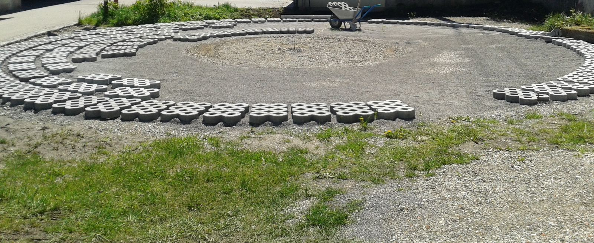
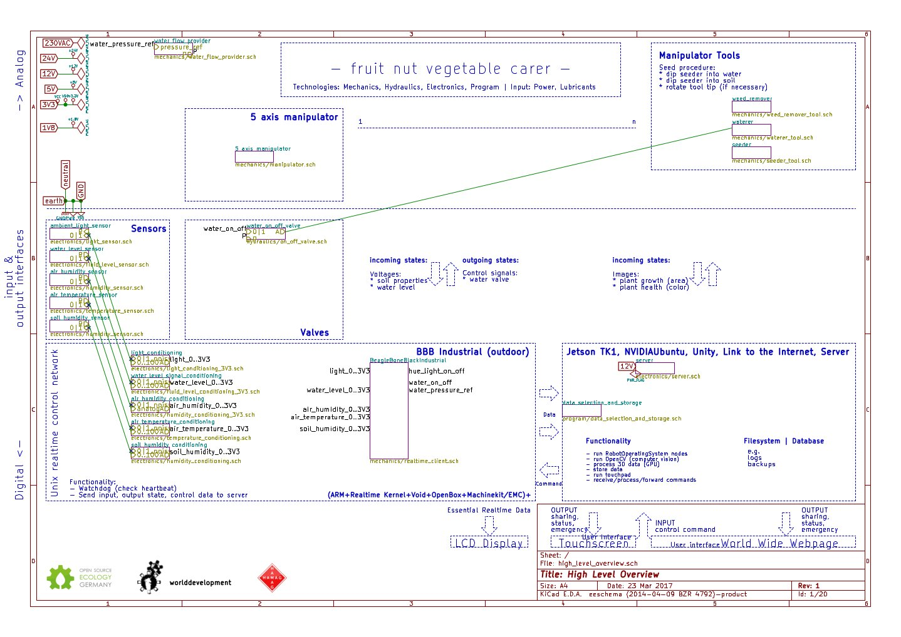

<!--
SPDX-FileCopyrightText: 2014 Thomas Kalka <thomas.kalka@co-buero.de>
SPDX-FileCopyrightText: 2014 Thomas Kalka <thomas.kalka@googlemail.com>
SPDX-FileCopyrightText: 2015 faerietree <radagast@dragontale.de>
SPDX-FileCopyrightText: 2017 - 2020 faerietree <radagast@ciry.at>
SPDX-FileCopyrightText: 2017 Jan R.I. B.F. v.W. v.Z. (faerietree) <radagast@ciry.at>
SPDX-FileCopyrightText: 2020 hoijui <hoijui.quaero@gmail.com>

SPDX-License-Identifier: CC-BY-SA-4.0
-->

# Fruit Nut Vegetable Carer

Open design and documentation for an agricultural robot similar in function to the AgroKruh, invented by Ján Šlinský, but simpler, cheaper (10K€ instead of 60K+€) and highly automated reusing the worlddevelopment pivot: [industrial robot](http://github.com/faerietree/manipulator).

## [Environment](res/assets/media/img/environment/README.md)

## Overview

### Variants

- \[deprecated\] Operates on a circular field. (Robot attached to linear slider which itself is attached to a rotational center joint.) \[see AgroKruh\]
- \[deprecated\] Operates on a linear field. (Robot attached to linear slider.) \[see FarmBot\]
- [5 axis manipulator](http://github.com/faerietree/manipulator) for static usage
- [walker](http://github.com/faerietree/walker) + [manipulator](http://github.com/faerietree/manipulator) for dynamic|infinite field size deployment.

## Requirements

- Operate on an as big as convenient ground surface to produce enough food
  to feed at least a dozen (12) people.
- Resolution high enough to reach as much of this surface as possible and useful.
- Prepare soil for growing plants on this surface of operation.
- Grow plants on this surface of operation.
- Allow manual intervention where and when appropriate.
- Cultivate and nurse ground and plants for fulfilling all requirements of plants
  (soil nutrients, light, water, space).

## Example: AgroKruh (by Ján Šlinský)

- Can automate 80% of the required work.
- Radial arm length 18m:
  surface of operation = PI * 18^2 = ca 1017m²
- Propulsion power input: 0,75 KW (typical electrical system efficiency)
- Power / year = 4000KW for 15 fields
  (radial arm can be mounted on several field center point slots).
- => 267 kWyear / field.
- Harvest: 2 tons / field.
- 1 robotic unit for 3..5 fields (also see satellite images)

## Documentation

- [AGROKRUH - Artistic, animated introduction (Slovak, video, 5:10)](https://vimeo.com/99343531)
- [AGROKRUH - All implements (English, video, 8:34)](http://www.youtube.com/watch?v=mYrJ0BJ4Qak)
- [AGROKRUH - All implements (Slovak, video, 3:22)](https://www.youtube.com/watch?v=nStEuHWJE-o)
- [AGROKRUH - sattelite view (Google Maps) of an array of fields](http://www.google.de/maps/@48.1699222,17.3968533,339m/data=!3m1!1e3)
- [AGROKRUH - Introductory text](http://ekumakad.cz/download/IVF/CEPTA%20-%20Introducing%20AGROKRUH.pdf)

Lets work on the
[OSEG Wiki](https://wiki.opensourceecology.de/AgroCircle)
to establish a first description and
[Roadmap (on GitHub)](https://github.com/thoka/AgroCircle/wiki/Roadmap).

### Models

The OpenSCAD 3D model source files in this repo were
[auto-generated from FreeCAD models](
https://forum.lulzbot.com/t/tip-converting-openscad-files-easily-to-step-with-freecad/228).

## Parts

### Port

[Agrokruh - port (Sloval, video)](http://www.youtube.com/watch?v=IMbGA-nOW64#t=53)

Function:

- Fixed installation holding a bearing.
- Accept 480VAC 3 phase electricity.
- Accept water.
- Optional electrical wiring for data (e.g. network).

Immobile due to high mass or good fixture to the ground.

### Rotary bearing

Function:

- Holding and rotary joint of the radial arm.
- Relays the connection of the port to the sliding element, tool.

Realisation:

[Agrokruh - rotary bearing (Sloval, video)](http://www.youtube.com/watch?v=IMbGA-nOW64#t=5m35)

- optional incremental encoder (for feedback)
- Electrical sliding contacts:
  5x (L1-3, Neutral, PE/Grounding),
- Build out of copper (Cu) tube, carbon, plastic,
- 16A current rating (Attention false friend: The longer the wire, the thicker it must be.).
- Sprocket/Gear for radial sliding movement chain.

### Radial slider

Function:

- Hold tool/person, absorb torque and forces.

Realisation:

- 3 sided,
- if required attach support wheel / stabiliser.
- Forklift beam, or lattice beam. Or custom weld.

## Main Propulsion (tangential direction)

Function:

- Circular movement and powering other actuators/tools.

Realisation:

- [Agrokruh - main propulsion - 1 (Slovak, video)](http://www.youtube.com/watch?v=Von3EgRGutw#t=1m35)
- [Agrokruh - main propulsion - 2 (Sloval, video)](http://www.youtube.com/watch?v=Von3EgRGutw#t=2m01)
- [Agrokruh - pedal propulsion (Sloval, video)](http://www.youtube.com/watch?v=fuixyXiodR8#t=26)
- 3phase motor + transmission (prototype utilizes 750W motor).
- Alternative:
  Custom wound motor, wound for torque and low RPM.
  Also possible is direct drive with an AC motor
  similar to how it's done in electric vehicles.

A main wheel with two stabilizing secondary wheels.\
Alternative: Two main wheels.

## Propulsion in radial (sliding) direction (speed sets spirale movement)

Ján Šlinský coupled the rotary movement in tangential direction
and uses this as energy source to move the slider.
This is possible by fixing e.g. a chain in the center,
such that the chain must rotate when the arm is moving around the center
(due to the motor attached to the outer tip).

The center attachment method,
e.g. sprocket/pulley diameter,
sets speed and gauge/track width of the spirale.

## Tool holder

- [Agrokruh - tool holder - 1 (Slovak, video)](http://www.youtube.com/watch?v=IMbGA-nOW64#t=4m30)
- [Agrokruh - tool holder - 2 (Sloval, video)](http://www.youtube.com/watch?v=IMbGA-nOW64#t=6m55)

- Self-constraining transmission ratio + stepper motor,
- Chain- or cable drive with feedback of the optional incremental encoder,
  to compensate for slip of the main drive
  (in tangential direction which is coupled to the sliding movement
  and thus the sliding speed varies).
- Position detection via markers on the traversing beam
  (slider holding structure).
  inductive, rfid, optical or position measurement
  (relative to e.g. center).
- High speed mode for returning to tool home position.
- Power outlet (for electrical tools),
- And/or PTO (power take-off) or pulley,
- Protection for wiring and (water) piping,
- Sliding plain bearing or rollers,
- Standardised Tool interface/coupler (e.g. of 1-axle tractors),
- Solenoid valve for water control.

## Tools

- Modified hand tools.
- Tools of 1-axle tractors.
- Custom-built.

[Overview of the used tools in Slovakia (Sloval, video)](https://www.youtube.com/watch?v=nStEuHWJE-o)

### Striding spades

[Agrokruh - striding spades (Sloval, video)](https://www.youtube.com/watch?v=2Rb5o1D7laI)

BAD link: http://www.agrokruh.sk/node/954

### Tiller

- [Tillage (Sloval, video)](https://www.youtube.com/watch?v=FOb1tvbV8-w)
- [Weed control (Sloval, video)](https://www.youtube.com/watch?v=Qy5D3NGZPzk)
  ('Beikraut' is the correct term. Thanks!
  'Unkraut' is misleading, creates sentiments like the 'Fischreiher'
  which is now called 'Graureiher'.)

### Grubber (Sowing/seeding preparation tool)

- [Grubber - 1 (Sloval, video)](http://www.youtube.com/watch?v=Von3EgRGutw#t=1m35)
- [Grubber - 2 (Sloval, video)](http://www.youtube.com/watch?v=Von3EgRGutw#t=3m55)

### Electronics (optional)

For automating task (e.g. watering time + amount).

- uC (micro-controller),
- inverter,
- timer,
- communication interface (e.g. WLAN or 2-wire bus I2C or CAN).

## Misc

### Ján Šlinský

An ecological farmer.
He has a diploma from the Mendel University in Brno, Faculty of Gardening.
Jan Šlinský is the author of the agricultural system Agrokruh,
whose main idea is to produce vegetables sustainably and ecologically.
He has also built a net of local buyers, thus supporting local trade in his area.
Jan Šlinský is a practical and witty person with a well-developed common sense.

> Enough talk, it's time to act.
It is not in the power of an individual to save the entire planet.
However, each of us can help a particular place on Earth.
But he must be sufficiently educated and skilled,
and he has to love the place he is aiding.

<!-- phone: 0918 655 564 -->

[Talk TEDx Bratislava (Slovak with English subtitles)](
http://www.youtube.com/watch?v=ZwP3A6z4sFc)

[HD version of TEDx Talk (Slovak with English subtitles)](
http://www.youtube.com/watch?v=2P7MGNLz5xE)

## Discussion

[OSE Germany - forum](http://forum.opensourceecology.de/viewtopic.php?f=28&t=632&p=3504#p3504)

[Google Groups](https://groups.google.com/forum/#!forum/agrocircle)
