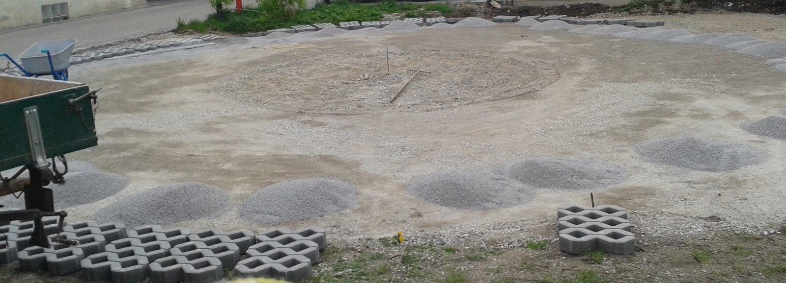
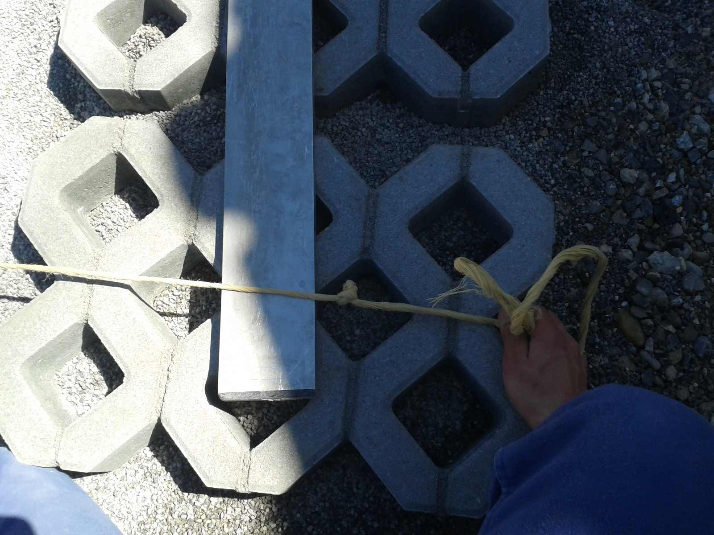
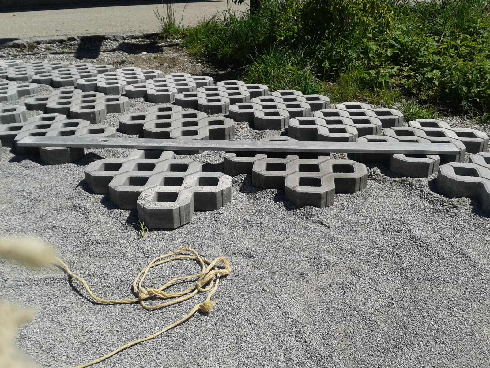
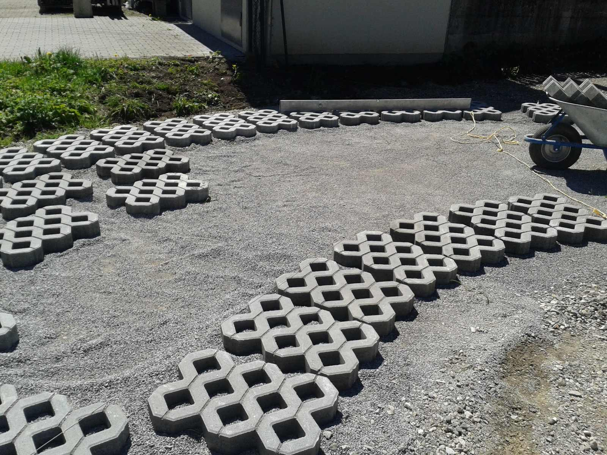
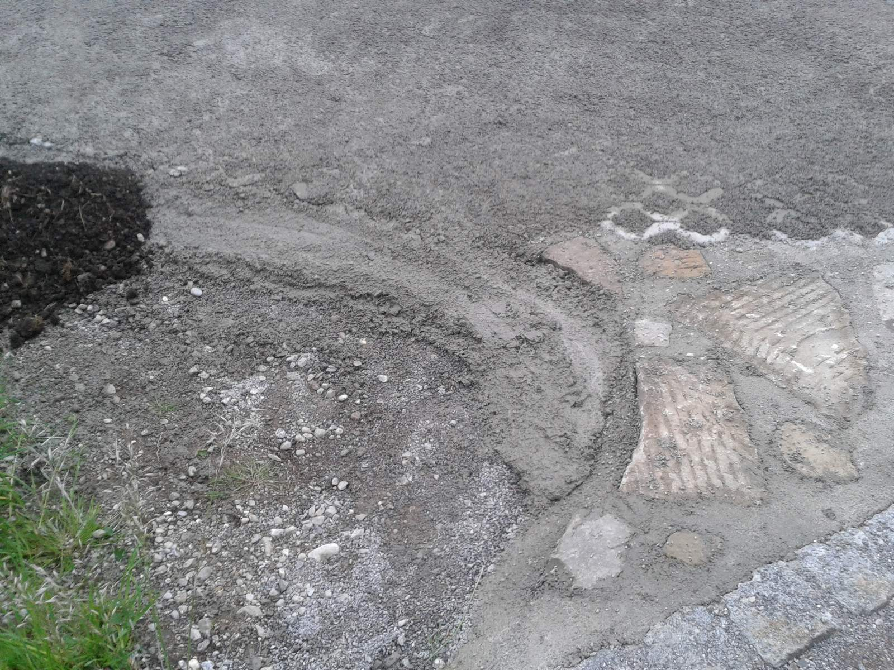
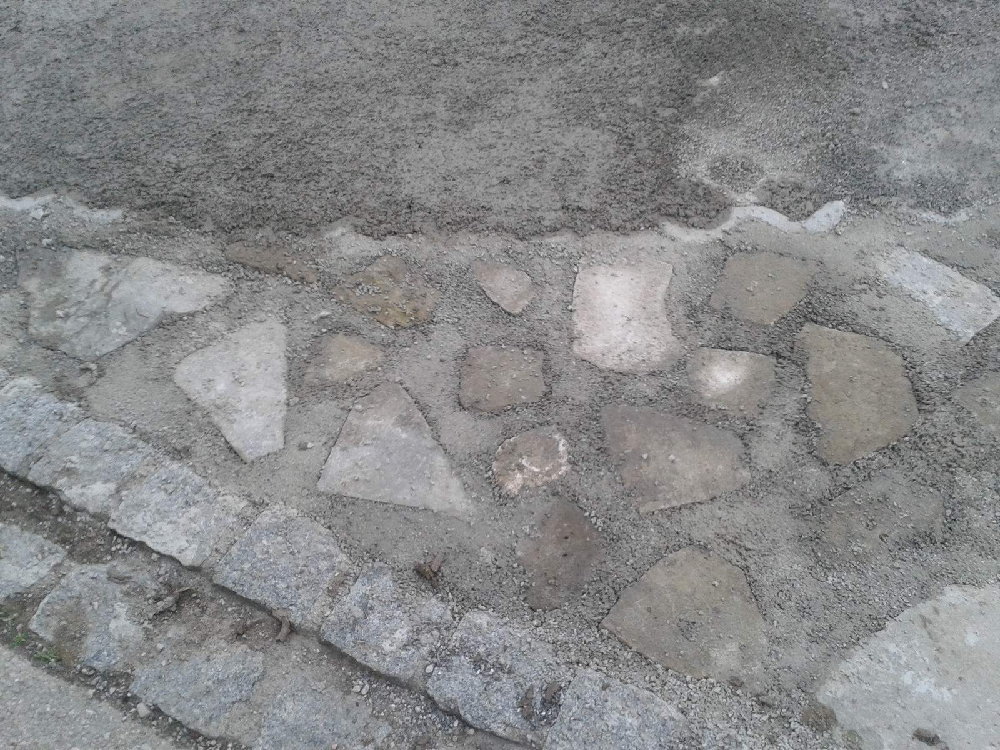
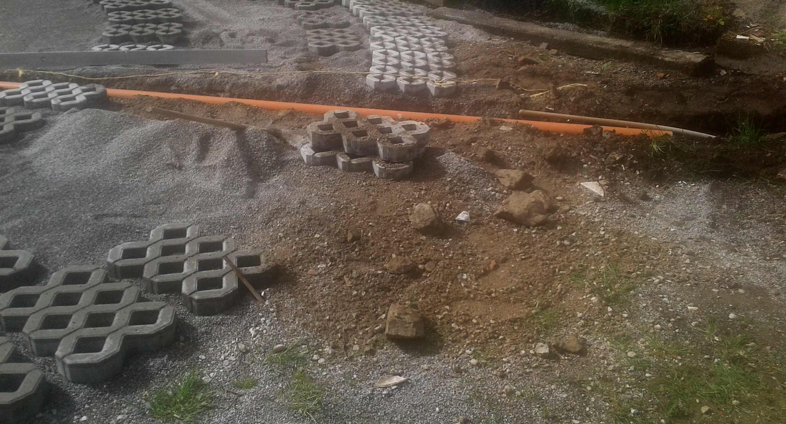
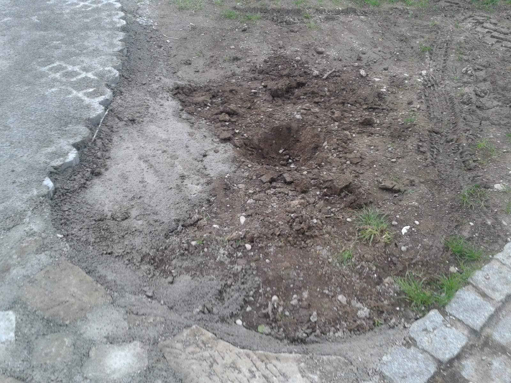
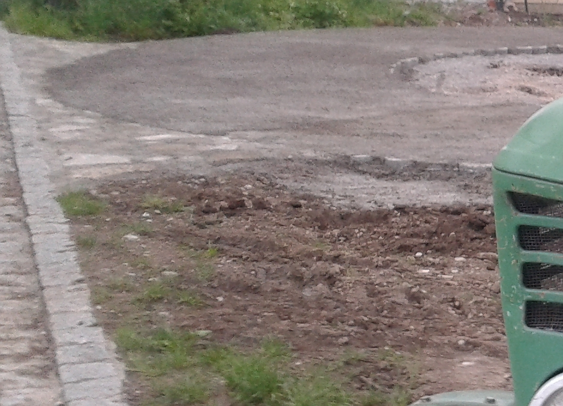

<!--
SPDX-FileCopyrightText: 2017 - 2020 faerietree <radagast@ciry.at>
SPDX-FileCopyrightText: 2023 Robin Vobruba <hoijui.quaero@gmail.com>

SPDX-License-Identifier: CC-BY-SA-4.0
-->

# Construction

1. Remove existing terrain (wilderness, earth, gravel, ...)

2. Create a slope using gravel and mud mix.

3. Compress ground to avoid deformation later but maintain slope. \
    

4. Again double check slope to get water
    and be level with surrounding elements like roads, nature elements, ...

5. Lay stones one by one in a circumverence using a rope and a center point
    and stone to stone distance measurements
    (approximation may be okay, extrapolate circle a priori
    to ensure that stones meet at the end). \
    

6. Using water level measure from existing stones to new stone,
    continuing the existing slope of the plane.
    Trouble can arise from wrong slope estimation in the beginning,
    such that the plane the stones span starts to sink into the ground
    and levitate at the other side.
    All stones have to be relaid in this case.
    (Happened to me.) \
     \
    

7. Get some fine split gravel or sand.
    Get cement.
    Fill spaces inbetween stones.
    Optionally fill the stones entirely to ease care.

8. Fine tune by laying nature stones in transition zone. \
     \
    

9. Lay an empty pipe to take the hydraulic lines later. \
    

10. Decide about decorative elements (tree, shrub, statue positions) \
    

11. Result \
    
